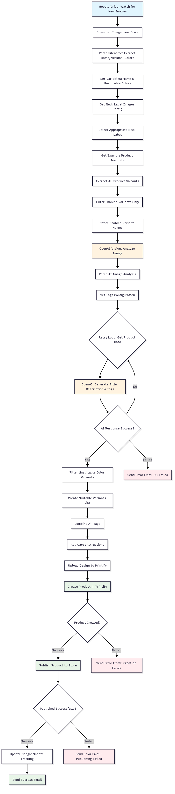

# Print-on-Demand Automation - Make.com Workflow

_Client Project - Proprietary Workflow_

## 🎯 What it Does

Intelligent automation that transforms design uploads into published products using AI analysis, smart variant filtering and automated publishing to Printify.

## ⚡ Key Features

- **OpenAI Vision API** analyses designs for content and color compatibility
- **Smart variant filtering** automatically excludes unsuitable color combinations
- **AI-generated content** creates SEO-optimised titles, descriptions and tags
- **Automated publishing** from Google Drive upload to live Printify product
- **Intelligent error handling** with email notifications and retry logic

## 🛠️ Built With

- **Make.com**
- **OpenAI Vision + GPT-4**
- **Printify API**
- **Google Drive + Sheets**

## 📊 Results

- **80% reduction** in product setup time
- **Automated quality control** through intelligent design-color matching
- **End-to-end automation** from upload to published product
- **Comprehensive tracking** and error handling

## 💡 Technical Highlights

- **AI vision analysis** determines design content and suitable variants
- **Dynamic color filtering** prevents design conflicts automatically
- **Template-based processing** uses existing products as blueprints
- **Retry mechanisms** handle API failures gracefully
- **Multi-stage error handling** with detailed notifications

---

---
